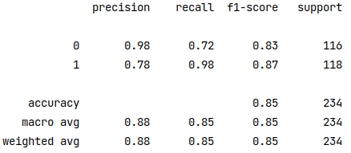

## dataset
HYPE student retention. learn more in dataset definitions.xlsx. the program introduction is [here](https://www.centennialcollege.ca/about-centennial/community/hype)
## workflow
### 1. preprocessing
some columns are dropped because of duplicate info or poor quality

missing values are filled with KNN imputer. column neighborhoods are identified by highly correlated columns which are showing in Phik of EDA

the encoder file stores a label encoder and pca for data processing in inference phase
### 2. modeling
catboost and deep & cross network are applied respectively

the metic of catboost is better and stable. instead, the average accuracy of deep & cross network only reaches 0.74 over five folders cross validation. here is the metric of catboost

